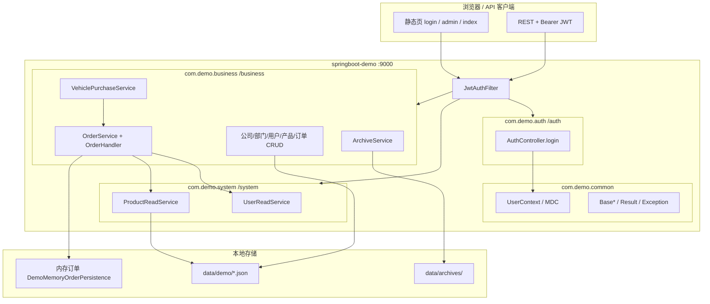
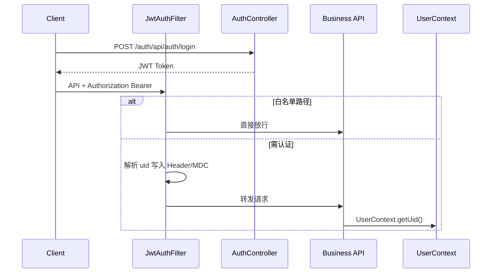
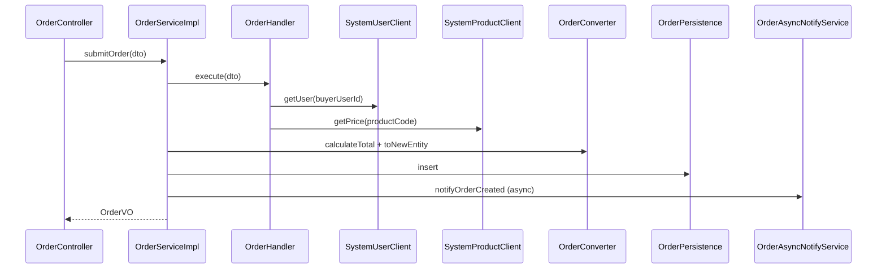
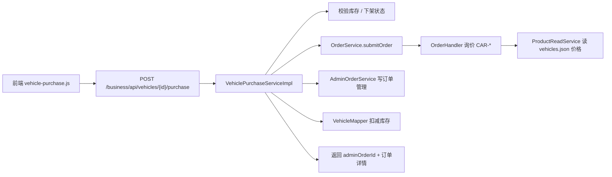
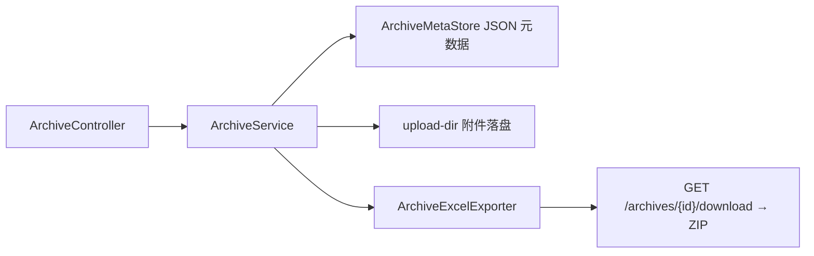

# springboot-demo

企业级 **Spring Boot 单机应用**脚手架：JDK 21、Spring Boot 3.3、前后端一体演示、模块化包结构、五层业务链路、无 Lombok / 无 MapStruct。

> 本项目由多模块 Spring Cloud 微服务演进为**单 Maven 模块、单进程**部署，保留 `/auth`、`/system`、`/business` 路径前缀，便于理解原微服务边界与进程内调用方式。

---

## 目录

- [特性概览](#特性概览)
- [技术栈](#技术栈)
- [项目结构](#项目结构)
- [包职责与分层](#包职责与分层)
- [整体架构](#整体架构)
- [核心业务流程](#核心业务流程)
- [API 路径约定](#api-路径约定)
- [数据存储](#数据存储)
- [前端页面](#前端页面)
- [快速开始](#快速开始)
- [配置说明](#配置说明)
- [接口示例](#接口示例)
- [测试](#测试)
- [扩展与演进](#扩展与演进)
- [架构约束](#架构约束)

---

## 特性概览

| 能力 | 说明 |
|------|------|
| JWT 认证 | 登录签发 Token，全局 Filter 校验，白名单放行静态页与文档 |
| 管理中心 CRUD | 公司、部门、用户、产品、订单 — JSON 文件持久化，支持重置种子 |
| 真实下单链路 | `business → system` 进程内调用：校验用户、询价、落单、异步通知 |
| 车辆购买 | 25 条品牌车型数据，列表/详情/下单/订单展示，含品牌 Logo |
| 档案管理 | 元数据 + 附件上传，支持单文件下载与 ZIP 打包下载（含 Excel 摘要） |
| 接口文档 | Knife4j / OpenAPI，统一入口 `/doc.html` |
| 主题切换 | 管理台支持明暗主题 |

---

## 技术栈

| 类别 | 选型 |
|------|------|
| 语言 / 运行时 | Java **21** |
| 框架 | Spring Boot **3.3.6**（Web / Validation / AOP / Actuator） |
| 安全 | JWT（jjwt **0.12.6**） |
| 文档 | Knife4j **4.5.0** + springdoc |
| 文件处理 | Apache POI **5.2.5**（档案 Excel 导出） |
| 测试 | JUnit 5 + Spock **2.4** + Mockito |
| 构建 | Maven **3.9+**，单模块 `jar` |
| 数据库 | **默认不使用**；`sql/schema.sql` 供接入 MySQL 参考 |

---

## 项目结构

```
springboot-demo/
├── pom.xml                          # 单模块 Maven 工程
├── README.md
├── sql/
│   └── schema.sql                   # MySQL 订单表参考脚本
├── data/                            # 运行时数据（gitignore，首次启动自动创建）
│   ├── demo/                        # 业务 JSON（公司/部门/车辆/订单等）
│   └── archives/                    # 档案附件落盘目录
└── src/
    ├── main/
    │   ├── java/com/demo/
    │   │   ├── app/                 # 启动类、JWT Filter、Web/安全配置
    │   │   ├── auth/                # 登录认证
    │   │   ├── system/              # 用户查询、商品询价（演示 system 域）
    │   │   ├── business/            # 业务域（CRUD、下单、车辆、档案）
    │   │   └── common/              # 公共基类、工具、异常、上下文
    │   └── resources/
    │       ├── application.yml      # 端口、JWT、数据目录等
    │       ├── demo-seed/           # JSON 种子数据（首次运行复制到 data/demo）
    │       ├── logback-spring.xml
    │       └── static/              # 前端静态资源
    │           ├── login.html       # 登录页
    │           ├── admin.html       # 管理后台
    │           ├── index.html       # API 联调页
    │           ├── css/             # app.css、themes.css
    │           ├── js/              # app.js、mock-crud.js、vehicle-purchase.js 等
    │           └── img/brands/      # 车辆品牌 SVG Logo
    └── test/
        ├── java/                    # JUnit 测试
        └── groovy/                  # Spock 规格测试
```

---

## 包职责与分层

### 模块包（逻辑域）

| 包路径 | 职责 | HTTP 前缀 |
|--------|------|-----------|
| `com.demo.app` | 启动入口 `DemoApplication`、JWT 过滤器、模块路径前缀、Knife4j | — |
| `com.demo.auth` | 演示登录，签发 JWT | `/auth` |
| `com.demo.system` | 内存用户表、SKU/车辆 SKU 询价 | `/system` |
| `com.demo.business` | 业务 CRUD、下单、车辆购买、档案 | `/business` |
| `com.demo.common` | `Result`、四大基类、全局异常、MDC、`UserContext` | — |

路径前缀由 `ModulePathPrefixConfig` 按 Controller 所在包自动挂载：

```text
com.demo.auth.controller.*      →  /auth/**
com.demo.system.controller.*    →  /system/**
com.demo.business.controller.*  →  /business/**
```

### 业务五层（business 域）

```text
Controller  →  Service  →  Converter  →  Handler  →  Mapper
   │              │            │             │            │
  HTTP         业务编排      对象转换      跨域调用      持久化
```

| 层级 | 基类 / 约定 | 典型类 |
|------|-------------|--------|
| Controller | `BaseController` | `OrderController`、`VehicleController`、`ArchiveController` |
| Service | `BaseService` | `OrderServiceImpl`、`VehiclePurchaseServiceImpl` |
| Converter | `BaseConverter` | `OrderConverter`、`VehicleConverter` |
| Handler | `BaseHandler` | `OrderHandler`（收口 system 用户/商品查询） |
| Mapper | `AbstractJsonFileMapper` | `VehicleMapper`、`CompanyMapper` |

跨「模块」调用不直接注入对方 Service，而是通过 **Handler + integration Client**（`SystemUserLocalClient` / `SystemProductLocalClient`）模拟原 Feign 边界。

---

## 整体架构

### 单机部署视图



### 请求安全链路



---

## 核心业务流程

### 通用下单（SKU）



### 车辆购买（完整链路）



车辆 SKU（`CAR-001` ~ `CAR-025`）价格在 **system 询价** 时从 `VehicleMapper` 动态读取，与列表展示价格保持一致。

### 档案管理



ZIP 内容：`档案信息.xlsx` + `附件/` 目录下所有上传文件。

---

## API 路径约定

完整 URL = `http://localhost:9000` + **模块前缀** + Controller `@RequestMapping`。

### auth 模块

| 方法 | 路径 | 说明 |
|------|------|------|
| POST | `/auth/api/auth/login` | 登录（白名单，无需 Token） |

### system 模块

| 方法 | 路径 | 说明 |
|------|------|------|
| GET | `/system/api/system/users/{userId}` | 查询演示用户 |
| GET | `/system/api/system/products/price?code=` | 商品询价（SKU-* 或 CAR-*） |

### business 模块

| 方法 | 路径 | 说明 |
|------|------|------|
| POST | `/business/api/orders/submit` | 提交真实订单 |
| GET/POST/PUT/DELETE | `/business/api/companies/**` | 公司 CRUD |
| GET/POST/PUT/DELETE | `/business/api/departments/**` | 部门 CRUD |
| GET/POST/PUT/DELETE | `/business/api/admin/users/**` | 后台用户 CRUD |
| GET/POST/PUT/DELETE | `/business/api/products/**` | 产品 CRUD |
| GET/POST/PUT/DELETE | `/business/api/admin/orders/**` | 订单管理 CRUD |
| GET | `/business/api/vehicles` | 在售车辆列表 |
| GET | `/business/api/vehicles/{id}` | 车辆详情 |
| POST | `/business/api/vehicles/{id}/purchase` | 购买车辆 |
| GET/POST/PUT/DELETE | `/business/api/archives/**` | 档案 CRUD / 上传 / 下载 |
| GET | `/business/api/business/storage-path` | 业务 JSON 存储路径 |

各 CRUD 模块均提供 `POST .../reset` 重置为 `demo-seed` 种子数据。

---

## 数据存储

| 类型 | 位置 | 说明 |
|------|------|------|
| 业务 JSON | `./data/demo/` | 公司、部门、用户、产品、订单、车辆；首次空库时从 `classpath:demo-seed/` 初始化 |
| 档案附件 | `./data/archives/` | 按档案 ID 分目录存储上传文件 |
| 真实订单 | 内存 | `DemoMemoryOrderPersistence`，进程重启后清空 |
| system 用户 | 内存 | 固定 ID：1、2、10086 |
| system 商品价格 | 内存 + 车辆 JSON | `SKU-*` 内置价；`CAR-*` 从车辆数据读取 |

种子文件一览：

```
src/main/resources/demo-seed/
├── companies.json
├── departments.json
├── users.json          # 后台用户 CRUD 演示数据
├── products.json
├── orders.json
└── vehicles.json       # 25 条品牌车型
```

> 若本地 `data/demo/vehicles.json` 仍为旧版 5 条数据，可删除该文件后重启，或手动与种子文件同步。

---

## 前端页面

| 地址 | 页面 | 说明 |
|------|------|------|
| http://localhost:9000/ | 登录页 | 成功后跳转 `admin.html` |
| http://localhost:9000/admin.html | 管理后台 | 工作台、CRUD、车辆购买、档案、API 联调 |
| http://localhost:9000/index.html | API 联调页 | 轻量接口测试 |
| http://localhost:9000/doc.html | 接口文档 | Knife4j |

### 管理台菜单

- **管理中心**：公司 / 部门 / 用户 / 产品 / 订单 / 车辆购买 / 档案
- **微服务联调**：用户查询、商品询价、提交订单（对应 system / business API）
- **系统**：健康检查、接口文档

### 前端脚本

| 文件 | 用途 |
|------|------|
| `js/app.js` | 登录会话、API 封装、页面路由 |
| `js/mock-crud.js` | 通用 CRUD 表格组件 |
| `js/vehicle-purchase.js` | 车辆列表 / 详情 / 下单 / 订单详情 |
| `js/brand-logos.js` | 中文品牌名 → Logo SVG 映射 |
| `js/archive-admin.js` | 档案管理 UI |
| `js/theme.js` | 主题切换 |

---

## 快速开始

### 环境要求

- JDK **21**
- Maven **3.9+**
- 无需 MySQL / Redis / Nacos

### 构建与运行

```bash
mvn clean install
mvn spring-boot:run
```

或在 IDE 中运行 `com.demo.app.DemoApplication`。

默认端口：**9000**。

### 演示账号

| userId | 密码 | 角色 |
|--------|------|------|
| 1 | 123456 | 超级管理员 |
| 2 | 123456 | 运营专员 |
| 10086 | 123456 | 普通用户 |

> 登录使用 **userId**（非 loginName）。后台「用户管理」中的 JSON 数据为 CRUD 演示，与 system 内存用户表相互独立。

---

## 配置说明

`src/main/resources/application.yml`：

```yaml
server:
  port: 9000

demo:
  security:
    jwt:
      secret: ...                    # 生产环境务必更换
      issuer: demo
      access-token-ttl-seconds: 7200
  business:
    demo:
      data-dir: ./data/demo          # 业务 JSON 目录
    archive:
      upload-dir: ./data/archives    # 档案附件目录
      max-file-size: 10485760
```

JWT 白名单（静态资源、登录、文档、健康检查）见 `AppSecurityProperties`。

---

## 接口示例

### 1. 登录

```http
POST http://localhost:9000/auth/api/auth/login
Content-Type: application/json

{"userId": 1, "password": "123456"}
```

响应 `data.token` 用于后续请求的 `Authorization: Bearer <token>`。

### 2. 商品询价

```http
GET http://localhost:9000/system/api/system/products/price?code=SKU-DEMO
Authorization: Bearer <token>
```

车辆询价示例：`code=CAR-001` 或任意 `CAR-*`。

### 3. 提交订单

```http
POST http://localhost:9000/business/api/orders/submit
Authorization: Bearer <token>
Content-Type: application/json

{"buyerUserId": 1, "productCode": "SKU-DEMO", "quantity": 2}
```

### 4. 购买车辆

```http
POST http://localhost:9000/business/api/vehicles/1/purchase
Authorization: Bearer <token>
Content-Type: application/json

{"quantity": 1, "remark": "希望周末提车"}
```

---

## 测试

```bash
mvn test
```

| 测试 | 说明 |
|------|------|
| `OrderHandlerMockitoTest` | Handler 远程调用 Mockito 单测 |
| `OrderHandlerSpec` | Spock 规格测试 |
| `OrderServiceImplSpec` | 下单服务 Spock 测试 |

---

## 扩展与演进

| 方向 | 建议 |
|------|------|
| 接入 MySQL | 参考 `sql/schema.sql`；将 `AbstractJsonFileMapper` 替换为 MyBatis-Plus Mapper |
| 接入 Redis | 替换 `RedisUtils` 占位实现；会话 / 缓存按需扩展 |
| 拆回微服务 | 将 `System*LocalClient` 改回 Feign Client，保留 Handler 边界不变 |
| 生产安全 | 外部化 JWT Secret；完善 RBAC；关闭演示固定密码 |

---

## 架构约束

1. **禁止** Lombok、MapStruct；Entity / DTO / VO 手写构造器与访问器。
2. 业务代码继承四大基类，走 **Controller → Service → Converter → Handler → Mapper**。
3. 跨模块调用收口在 **Handler**；对象转换收口在 **Converter**。
4. 异步线程中需**手动**设置并清理 `UserContext` 与 MDC（见 `OrderAsyncNotifyService`）。
5. 配置前缀统一为 `demo.*`（非历史 `cloud.*`）。

---

## 许可证

演示项目，按需 fork 与改造。
